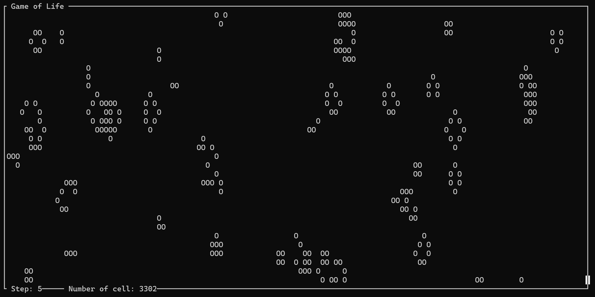
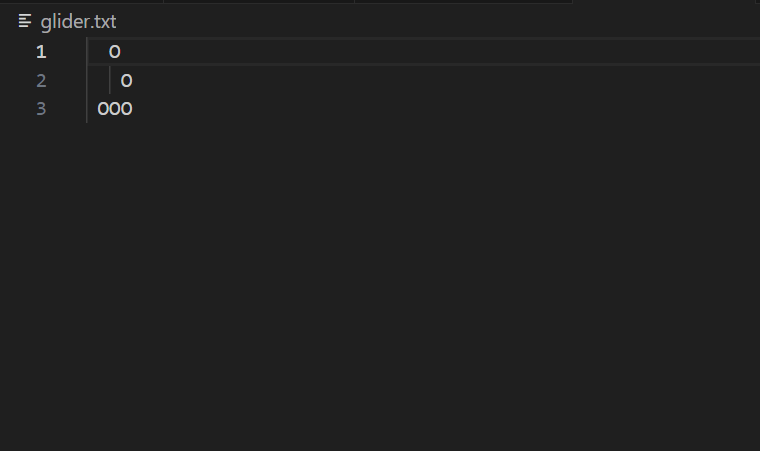

# Game of Life

also known as Life, is a [cellular automaton](https://en.wikipedia.org/wiki/Cellular_automaton) developed by British mathematician [John Horton](https://en.wikipedia.org/wiki/John_Horton_Conway) Conway in 1970. It is a playerless game, meaning that its evolution is determined only by its initial state. The game is [Turing complete](https://en.wikipedia.org/wiki/Turing_completeness), so it can simulate a [Turing machine](https://en.wikipedia.org/wiki/Turing_machine).

For more information on this topic, see [Wikipedia](https://en.wikipedia.org/wiki/Conway%27s_Game_of_Life).

Screenshot of how the game works

## Rules

* Every living cell with fewer than two living neighbors dies, due to loneliness.
* Any living cell with two or three living neighbors lives until the next generation.
* Każda żywa komórka z więcej niż trzema żywymi sąsiadami umiera, z powodu przeludnienia.
* Każda martwa komórka z dokładnie trzema żywymi sąsiadami staje się żywą komórką, z powodu reprodukcji.

## Implementation

The game is played on a square board with the dimensions specified in the configuration file. In addition, in the situation of reaching the border of the board, there is a jump to the opposite edge of the board, which makes the game play out on a torus.

The thoughtful mode of operation of the program is to generate a random initial cell setting, alternatively, the user can specify start seed.

> [!WARNING]
> The program window can only be increased, reducing it will cause the program to shut down. 

You exit the program using the key combination Ctrl+c.

## Option

* **-c / --config=FILE** - reads the settings from the specified FILE, the default is config.txt
* **-s / --seed=FILE** - reads the initial state from the specified FILE
* **-l / --len** - display size of your window (how many characters will fit)
* **-h / --help** - display help and exit

## Config File

This is the file from which the program reads its settings and, which allows them to be easily modified. This file is saved in NAME.txt format. By default, this file is config.txt. Below is the list of available options:

* **#** - character starting a comment line
* **board_size** - board side length
* **sleep_time** - waiting time[s] between game steps
* **numbers_of_cell** - number of cells that will appear on the board, works only in random mode
* **random_distribution** - draws the distribution of cells according to the selected distribution, works only in random mode:
    - **fixed** - fixed distribution
    - **triang** - triangular distribution
    - **gauss** - Gaussian distribution

> [!WARNING]
> If there is no cofiguration file, or any of the options are not included in it, it will cause the game to return an error.

## Seed File

> [!IMPORTANT]
> In file and program upper left corner are the coordinates (0,0).

This type of file contains information about the initial state of the game, it should only consist of spaces and uppercase "o" characters. Other characters will be replaced by spaces by the program. This file is saved in NAME.txt format.

* " " - dead cell
* "O" - living cell

The position of these marks corresponds one-to-one to the position of the cells on the board.

Examples of such files can be found in the seed_exaple folder.

Screenshot of seed file example